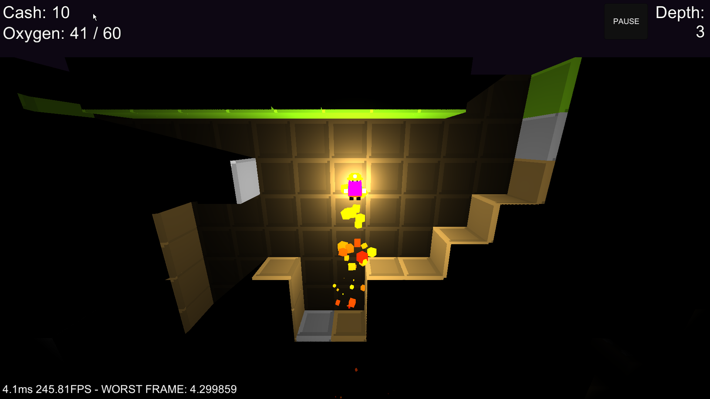

<iframe src="//www.youtube.com/embed/_NpiSot1c-g" frameborder="0" allowfullscreen></iframe>

> I've linked a video/vlog that wasn't originally linked to this devlog!
{: .prompt-tip }

## What is Bacon Game Jam?

Bacon Game Jam is a 48-hour Reddit community-powered game jam. The rules are fairly relaxed, and it’s always a fun time.

## Game Link:

[https://bacongamejam.org/jams/bacongamejam-09/373/](https://bacongamejam.org/jams/bacongamejam-09/373/)

## Watch the Game Get Made!

I streamed the entire development process on Twitch.

[http://www.twitch.tv/trent\_sterling](http://www.twitch.tv/trent_sterling)

## About BUTTLOADS!

BUTTLOADS! was heavily inspired by *Motherlode*—you dig, upgrade, and descend into chaos.

The code was a mess, and I wasted a lot of time trying to get it working on Android. In the last six hours, I scrapped the Android port in favor of dynamic shadows and better controls.

My artist got sick, so I used some art from viewers. After the jam, I planned to clean up the game, fix bugs, and eventually finish the Android port.

## Screenshots:

